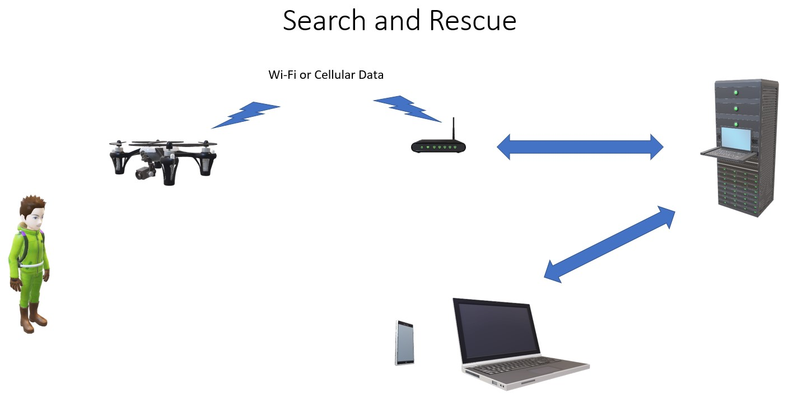

# Flying robot

[A flying robot has been built as a development platform.](https://github.com/PhilippeDoucette/Intel-RTF-Drone-with-servo-control/wiki)  Client/Server architecture is used to reduce the computational load on the robot.  Most computation is done on servers, while the robot acts as a client.  The robot may then have a smaller computer and lower cost. The server shares its workload among many robot-clients.  
Computation that would be difficult or impossible to perform on the robot is done on the servers.  
* Large datasets
* Human voice processing 
* Swarm oordination

## Example Application

## Hardware

Intel® RTF Drone connected to an Arduino provides a powerful ROS computer with simple connections to external devices. All manner of servos, stepper motors, and a vast array of sensors may be connected to a flying/driving robot platform. The Intel system runs ROS Ubuntu and connects to the Arduino using RosSerial.

## Systems
### Intel RTF Drone
* Intel Atom 64 bit computer running Ubuntu & ROS
* Global positioning system (GPS)
* Inertial measurement unit (IMU) 
* Wi-Fi as access point or connectivity to LAN
* Celluar modem connectivity to internet
* Flight controller
* Electronic Speed controllers (ESP) for rotors
* RealSense 3D camera
* Forward camera
* Dowward camera
* MicroSD card slot
* Beacon LED's
* 18 channel Micro Serial Receiver DSMX 2.4GHz RF (Radio Control)
* HDMI monior output
* USB 3 connetion for mouse and keyboard
### Arduino Due
* [Differential drive wheels](https://github.com/PhilippeDoucette/Flying-Robot/wiki/Differential-drive-wheels)
* Servo controllers
* Stereo amplifier and speakers
* Text-to-speech speech system and speaker
* MicroSD card slot
* White bright LED's for area illumination
* Tri-color bright LED's as emergency display lights

This site is under development, documenting the current state of the project
